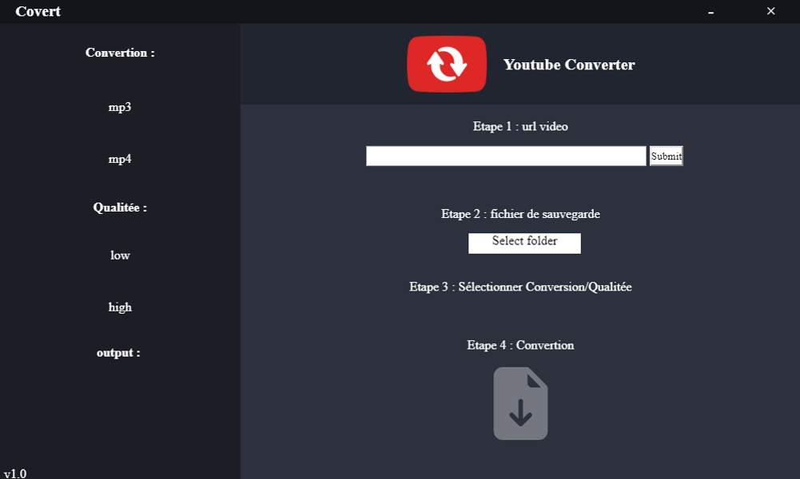

# Covert

## Preview

Converter youtube to audio/video with interface

## Install

Packaging (mp) or terminal

**Require nodejs**

    node -v
    sudo apt install nodejs

**Clone this repository**

    git clone https://github.com/Bynawers/Desktop-Converter.git

**Install dependencies**

    npm install

**Run the app**

    npm start
